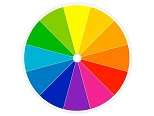

<h1 align="center">Color Palette</h1>

---
- This is a color picker or color palette generator using simple HTML, CSS & JavaScript.

---
## List of Functions:
   - [createmyElements(tagName, classes, id)](#createmyElement())
   - [color()](#color())
   - [colorGenerator()](#colorGenerator())
   - [rgb2Hex(orig)](#rgb2Hex())

## Functions details:
---
- ### createmyElements() 
```javascript
  /**
 * This is used to create a DOM element
 * @param {string} tagName To create Html tag (i.e. div)
 * @param {string} classes Set the class attribute
 * @param {string} id Set the id attribute
 */
function createmyElements(tagName, classes, id) {
    const element = document.createElement(tagName);
    element.setAttribute("class", classes);
    element.setAttribute("id", id);

    return element;
}
```
- ### color()
```javascript
/**
 * This generate different color palette on buttom click
 */
function color() {
    for (let index = 0; index < 6; index++) {
        const colorRGB = colorGenerator();
        const colorHEX = rgb2Hex(colorRGB);
        console.log(colorHEX);
        const colorId = "color" + index;
        document.getElementById(colorId).style.backgroundColor = colorRGB;
        document.getElementById(colorId).innerHTML = `<h1>#${colorHEX}</h1> <br/> <h3>${colorRGB}</h3> `;
    }
}
```
- ### colorGenerator()
```javascript
/**
 * RGB color generator
 */
function colorGenerator() {
    const red = Math.floor(Math.random() * 256);
    const green = Math.floor(Math.random() * 256);
    const blue = Math.floor(Math.random() * 256);
    const rgb = `rgb(${red}, ${green}, ${blue})`;

    return rgb;
}
```
- ### rgb2Hex()
```javascript
/**
 * Convert RGB to HEX value of color
 * @param {string} orig rgb value to be pass("rgb(255, 102, 136))
 */
function rgb2Hex(orig) {
    const rgb = orig.replace(/\s/g, '').match(/^rgb?\((\d+),(\d+),(\d+),?([^,\s)]+)?/i);
    const hex = rgb ?
    (rgb[1] | 1 << 8).toString(16).slice(1) +
    (rgb[2] | 1 << 8).toString(16).slice(1) +
    (rgb[3] | 1 << 8).toString(16).slice(1) : orig;

    return hex;
}
```